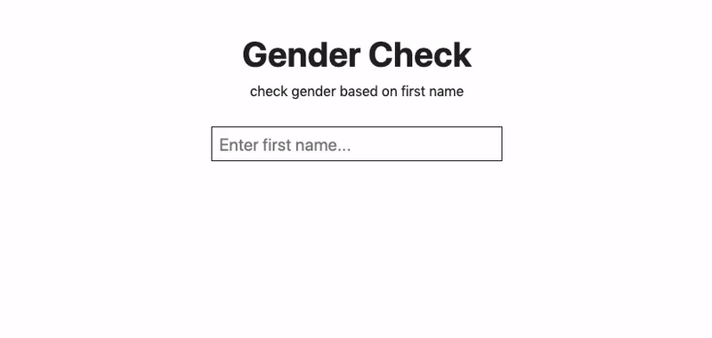

# GenderCheck

Check the gender of any name. Check it out at [xtrp.github.io/gendercheck/](https://github.com/xtrp/gendercheck/)!

## Written in

HTML, CSS, vanilla JavaScript. Uses asynchronous client-side AJAX requests to get the gender of the input box realtime. Uses the [Genderize API](https://genderize.io/).

## License and Credits

Built by Fred Adams, licensed under the MIT License. See LICENSE.txt for more info.
